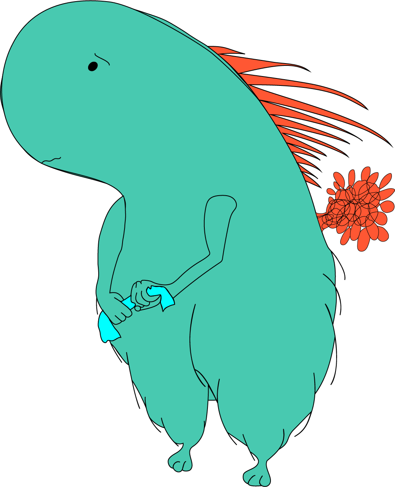

While this website is 100% silly, it does serve one moderately serious purpose, which is to demonstrate my abilities as a fullstack developer. The images are created by me using adobe illustrator and a mysql database of svg code snippets (in xml).

